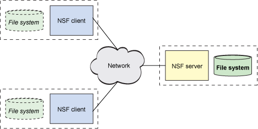
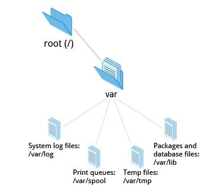
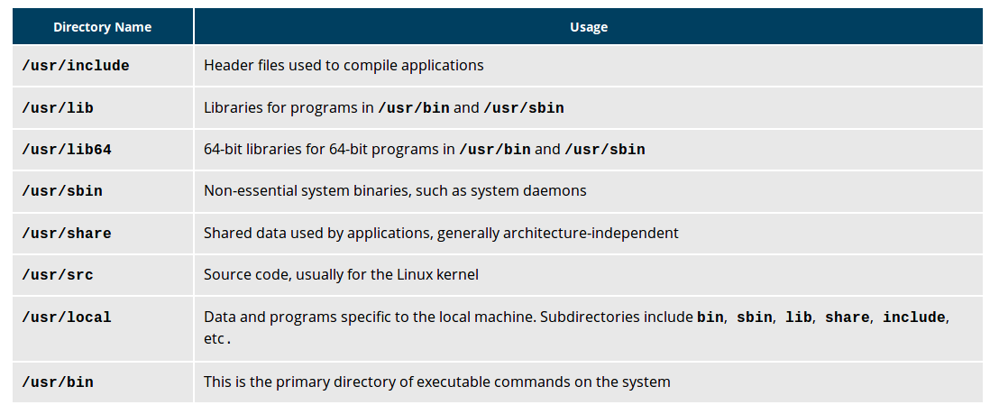

##Filesystems

Linux supports a number of native filesystem types, expressly created by Linux developers, such as:
 * ext3
 * ext4
 * squashfs
 * btrfs. 

It also offers implementations of filesystems used on other alien operating systems, such as those from:
 * Windows (ntfs, vfat)
 * SGI (xfs)
 * IBM (jfs)
 * MacOS (hfs, hfs+).
j
Many older, legacy filesystems, such as FAT, are also supported.


If you want it to be automatically available every time the system starts up, you need to edit `/etc/fstab` accordingly (the name is short for filesystem table). Looking at this file will show you the configuration of all pre-configured filesystems. `man fstab` will display how this file is used and how to configure it.

## NFS 


The most common such filesystem is named simply NFS (the Network Filesystem). It has a very long history and was first developed by Sun Microsystems. Another common implementation is CIFS (also termed SAMBA), which has Microsoft roots. We will restrict our attention in what follows to NFS.

### Server
On the server machine, NFS uses daemons.  
```
sudo systemctl start nfs
```
The text file /etc/exports contains the directories and permissions that a host is willing to share with other systems over NFS.  

After modifying the /etc/exports file, you can use the exportfs -av command to notify Linux about the directories you are allowing to be remotely mounted using NFS. You can also restart NFS with sudo systemctl restart  nfs, but this is heavier, as it halts NFS for a short while before starting it up again. To make sure the NFS service starts whenever the system is booted, issue sudo systemctl enable nfs.  

### Client

On the client machine, if it is desired to have the remote filesystem mounted automatically upon system boot, the /etc/fstab file is modified to accomplish this. For example, an entry in the client's /etc/fstab file might look like the following:

servername:/projects /mnt/nfs/projects nfs defaults 0 0

You can also mount the remote filesystem without a reboot or as a one-time mount by directly using the mount command:

$ sudo mount servername:/projects /mnt/nfs/projects

Remember, if /etc/fstab is not modified, this remote mount will not be present the next time the system is restarted. Furthermore, you may want to use the nofail option in fstab in case the NFS server is not live at boot.

Typically, mount will show more filesystems mounted than are shown in /etc/fstab , which only lists those which are explicitly requested.

The system, however, will mount additional special filesystems required for normal operation, which are not enumerated in /etc/fstab .

Another way to show mounted filesystems is to type:

sudent:/tmp> cat /proc/mounts

which is essentially how the utility gets its information.  

## FileSystem Architecture

### /bin and /sbin

The /`bin` directory contains executable binaries, essential commands used to boot the system or in single-user mode, and essential commands required by all system users, such as cat, cp, ls, mv, ps, and rm.  
Likewise, the `/sbin` directory is intended for essential binaries related to system administration, such as fsck and shutdown.


### /proc
 Certain filesystems, like the one mounted at /proc, are called pseudo-filesystems because they have no permanent presence anywhere on the disk.

The /proc filesystem contains virtual files (files that exist only in memory) that permit viewing constantly changing kernel data. This filesystem contains files and directories that mimic kernel structures and configuration information. It does not contain real files, but runtime system information, e.g. system memory, devices mounted, hardware configuration, etc. Some important files in /proc are:

/proc/cpuinfo
/proc/interrupts
/proc/meminfo
/proc/mounts
/proc/partitions
/proc/version

/proc has subdirectories as well, including:

/proc/<Process-ID-#>
/proc/sys

### /dev

The /dev directory contains device nodes, a type of pseudo-file used by most hardware and software devices, except for network devices. This directory is:

Empty on the disk partition when it is not mounted

Contains entries which are created by the udev system, which creates and manages device nodes on Linux, creating them dynamically when devices are found. The /dev directory contains items such as:

 * /dev/sda1 (first partition on the first hard disk)
 * /dev/lp1 (second printer)
 * /dev/random (a source of random numbers).

### /var 

The /var directory contains files that are expected to change in size and content as the system is running (var stands for variable), such as the entries in the following directories:

 * System log files: /var/log
 * Packages and database files: /var/lib
 * Print queues: /var/spool
 * Temporary files: /var/tmp.

The /var directory may be put on its own filesystem so that growth of the files can be accommodated and the file sizes do not fatally affect the system. Network services directories such as /var/ftp (the FTP service) and /var/www (the HTTP web service) are also found under /var.


 
### /etc

The /etc directory is the home for system configuration files. It contains no binary programs, although there are some executable scripts. For example, /etc/resolv.conf tells the system where to go on the network to obtain host name to IP address mappings (DNS). Files like passwd, shadow and group for managing user accounts are found in the /etc directory. While some distributions have historically had their own extensive infrastructure under /etc (for example, Red Hat and SUSE have used /etc/sysconfig), with the advent of systemd there is much more uniformity among distributions today.

Note that /etc is for system-wide configuration files and only the superuser can modify files there. User-specific configuration files are always found under their home directory.

### /boot

The /boot directory contains the few essential files needed to boot the system. For every alternative kernel installed on the system there are four files:

 * vmlinuz
   - The compressed Linux kernel, required for booting.
 * initramfs
   - The initial ram filesystem, required for booting, sometimes called initrd, not initramfs.
 * config
  - The kernel configuration file, only used for debugging and bookkeeping.
  * System.map
   - Kernel symbol table, only used for debugging.

Each of these files has a kernel version appended to its name.

The Grand Unified Bootloader (GRUB) files such as /boot/grub/grub.conf or /boot/grub2/grub2.cfg are also found under the /boot directory.

### /lib and /lib64

/lib contains libraries (common code shared by applications and needed for them to run) for the essential programs in /bin and /sbin. These library filenames either start with ld or lib. For example, /lib/libncurses.so.5.9.

Most of these are what is known as dynamically loaded libraries (also known as shared libraries or Shared Objects (SO)). On some Linux distributions there exists a /lib64 directory containing 64-bit libraries, while /lib contains 32-bit versions.

/lib contains libraries (common code shared by applications and needed for them to run) for the essential programs in /bin and /sbin. These library filenames either start with ld or lib. For example, /lib/libncurses.so.5.9.

Most of these are what is known as dynamically loaded libraries (also known as shared libraries or Shared Objects (SO)). On some Linux distributions there exists a /lib64 directory containing 64-bit libraries, while /lib contains 32-bit versions.

i.e just like for /bin and /sbin, the directories just point to those under /usr.

Kernel modules (kernel code, often device drivers, that can be loaded and unloaded without re-starting the system) are located in /lib/modules/<kernel-version-number>.

### Removable media: the /media, /run and /mnt Directories

One often uses removable media, such as USB drives, CDs and DVDs. To make the material accessible through the regular filesystem, it has to be mounted at a convenient location. Most Linux systems are configured so any removable media are automatically mounted when the system notices something has been plugged in.

While historically this was done under the /media directory, modern Linux distributions place these mount points under the /run directory. For example, a USB pen drive with a label "myusbdrive" for a user name "student" would be mounted at /run/media/student/myusbdrive.

The /mnt directory has been used since the early days of UNIX for temporarily mounting filesystems. These can be those on removable media, but more often might be network filesystems with NFS, which are not normally mounted. Or these can be temporary partitions, or so-called loopback filesystems, which are files which pretend to be partitions.

### /usr 



### other folder
| Directory Name | Usage |
| --- | --- |
| /opt | Optional application software packages |
| /sys | Virtual pseudo-filesystem giving information about the system and the hardware. Can be used to alter system parameters and for debugging purposes |
| /srv | Site-specific data served up by the system Seldom used |
| /tmp | Temporary files; on some distributions erased across a reboot and/or may actually be a ramdisk in memory |
| /usr | Multi-user applications, utilities and data |

## Compparing files and types

### files 

you can use use `diff` 
to compare 3 files once use `diff3`

`file` show you the file utility 