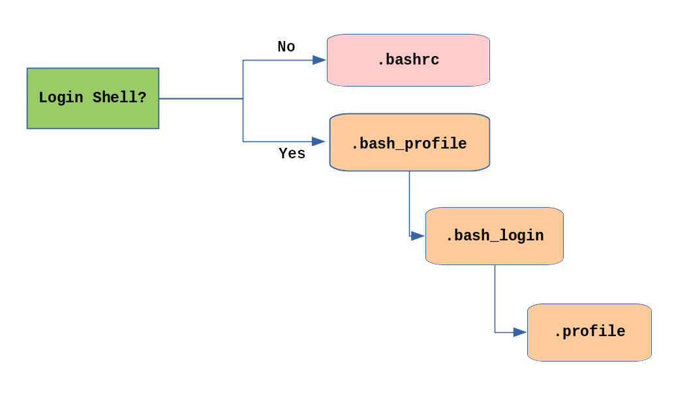
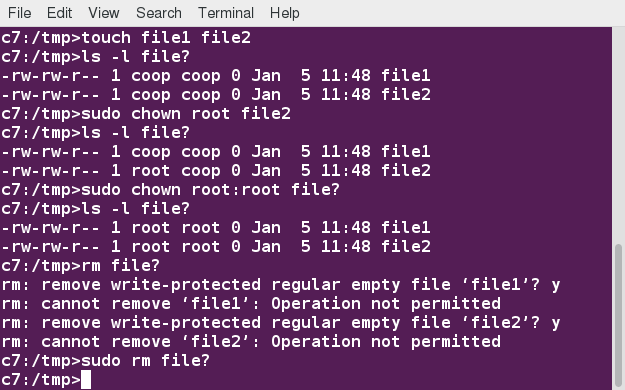

# CHAPTER 12 : User Environement

## Accounts, Users and Groups 

For identifying user on Linux system, we can use ; 
 * `ẁhoami`
 * `ẁho`: for list thrcurrent logged-on users

Files in the `/etc` directory define global settings for all users, while initialization files in the user's home directory can include and/or override the global settings.

### Order of startup Files

The standard prescription is that when you first login to Linux, `/etc/profile` is read and evaluated, after which the following files are searched (if they exist) in the listed order:

 * ~/.bash_profile
 * ~/.bash_login
 * ~/.profile 

The Linux login shell evaluates whatever startup file that it comes across first and ignores the rest. This means that if it finds ~/.bash_profile, it ignores ~/.bash_login and ~/.profile. Different distributions may use different startup files. 

However, every time you create a new shell, or terminal window, etc., you do not perform a full system login; only a file named ~/.bashrc file is read and evaluated. Although this file is not read and evaluated along with the login shell, most distributions and/or users include the ~/.bashrc file from within one of the three user-owned startup files.

Most commonly, users only fiddle with ~/.bashrc, as it is invoked every time a new command line shell initiates, or another program is launched from a terminal window, while the other files are read and executed only when the user first logs onto the system.

Recent distributions sometimes do not even have .bash_profile or .bash_login (Ubuntu) and some just have it do little more than include .bashrc.



### Creating Aliases

Aliases are most often placed in `.bashrc`.
Type `alias <commad>` to alias a command.  
Type `unalias <alais_name>` to remove it.  
Type `alias` to list it.

### Users and groups

Each user have a unique ID.  
Groups are collections of accounts with certain shared permissions. Control of group membership is administered through the `/etc/group` file.    
Users also have one or more group IDs (gid), including a default one which is the same as the user ID. These numbers are associated with names through the files `/etc/passwd` and `/etc/group`.

Adding a new user is done with `useradd` and removing an existing user is done with `userdel`(use -r to remove home directory).

Typing `id` with no argument gives information about the current user.  

Adding a group : `groupadd`
Remove a group : `groupdel`
Adding a user to an already existing group is done with `usermod`.
```sh
$ sudo /usr/sbin/usermod -a -G anewgroup flo
```

### sudo 

sudo configuration files are stored in the `/etc/sudoers` file and in the `/etc/sudoers.d/` directory. By default, the `sudoers.d` directory is empty.


## Environement variables

Type `env` to see env variables.  
 Allowing child processes to see the values requires use of the `export` command.  

 ```sh
 # show variable 
 echo $SHELL
 # export a new variable
 export VARAIABLE=plop
 # or 
 VARIABLE=plop
 export VARIABLE
 ```
To add a variable permanentely, edit your `.bashrc` and `source` it after.

To set env variable to be fed as one shot to a command, set it before call of command : 
```sh
$ SDIRS=s_0* KROOT=/lib/modules/$(uname -r)/build make modules_install
```

`HOME` variable represent the home directory of teh user.
`PATH` is an ordered list of directories (the path) which is scanned when a command is given to find the appropriate program or script to run.  
`SHELL` points to the user's default command shell.  
`PS1` is the primary prompt variable which controls what your command line prompt looks like.  

## Recalling Previous Commands

To view the list of previously executed commands, you can just type `history` at the command line.
This information is stored in `~/.bash_history`.

`HISTFILE` : The location of the history file. 
`HISTFILESIZE` : The maximum number of lines in the history file (default 500). 
`HISTSIZE` : The maximum number of commands in the history file. 
`HISTCONTROL` : How commands are stored. 
`HISTIGNORE` : Which command lines can be unsaved.

`!!` execute the previous command.

| Syntax | Task |
| --- | --- |
| ! | start a history substitution |
| !$ | Refer to the last argument in a line |
| !n | Refer to the nth command line |
| !string | Refer to the most recent command starting with string |

### Keyboard shortcut 

| Keyboard Shortcut | task |
| --- | --- |
| <kbd>Ctrl+L</kbd> | Clears the screen |
| <kbd>CTRL-D</kbd> | Exits the current shell |
| <kbd>CTRL-Z</kbd> | Puts the current process into suspended background |
| <kbd>CTRL-C</kbd> | Kills the current process |
| <kbd>CTRL-H</kbd> | Works the same as backspace |
| <kbd>CTRL-A</kbd> | Goes to the beginning of the line |
| <kbd>CTRL-W</kbd> | Deletes the word before the cursor |
| <kbd>CTRL-U</kbd> | Deletes from beginning of line to cursor position |
| <kbd>CTRL-E</kbd> | Goes to the end of the line |
| <kbd>Tab</kbd> |    Auto-completes files, directories, and binaries |

 ## File Permission 

 Every file, in Linux, is asociated with a user and a group. 
 * `chown` : Used to change user ownership of a file or directory
 * `chgrp` : Used to change group ownership 
 * `chmod` : Used to change the permissions on the file, which can be done separately for owner, group and the rest of the world (often named as other).

Files have three kinds of permissions: read (`r`), write (`w`), execute (`x`). These are generally represented as in `rwx`. These permissions affect three groups of owners: user/owner (`u`), group (`g`), and others (`o`).

```
rwx: rwx: rwx
 u:   g:   o

$ ls -l somefile
-rw-rw-r-- 1 student student 1601 Mar 9 15:04 somefile
$ chmod uo+x,g-w somefile
$ ls -l somefile
-rwxr--r-x 1 student student 1601 Mar 9 15:04 somefile

# or 

$ chmod 755 somefile
$ ls -l somefile
-rwxr-xr-x 1 student student 1601 Mar 9 15:04 somefile

```

