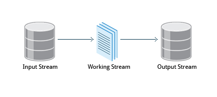

# CHAPITER 13 : Manipulating Text

## Cat

stand for *concatenate*.  
`cat readme.txt` will display the contents of readme.txt on the terminal.
The `tac` command (cat spelled backwards) prints the lines of a file in reverse order.

### Using cat interactively 
To create a new file, at the command prompt type `cat > <filename>` and press the **Enter** key (use `>>` to append at the end of file).

This command creates a new file and waits for the user to edit/enter the text. After you finish typing the required text, press <kbd>CTRL-D</kbd> at the beginning of the next line to save and exit the editing.

Another way to create a file at the terminal is `cat > <filename> << EOF`. A new file is created and you can type the required input. To exit, enter `EOF` at the beginning of a line.

**Note that EOF is case sensitive**. One can also use another word, such as `STOP`.

```sh
flo@flo-X301A:~/git/learnNewThingsEveryday$ cat > test_cat.txt
plip
plop
toto
tata
flo@flo-X301A:~/git/learnNewThingsEveryday$ cat test_cat.txt 
plip
plop
toto
tata
flo@flo-X301A:~/git/learnNewThingsEveryday$ 
```


## echo 

`echo` simply displays (echoes) text.  

The `–e` option, along with the following switches, is used to enable special character sequences, such as the newline character or horizontal tab.
 * `\n`  represents newline
 * `\t`  represents horizontal tab.

## less 

Use `less` to read large files 

## head

`head` reads the first few lines of each named file (10 by default) and displays it on standard output.

## tail 

`tail` prints the last few lines of each named file and displays it on standard output. By default, it displays the last 10 lines. 

To continually monitor new output in a growing log file:
```
$ tail -f somefile.log 
```
This command will continuously display any new lines of output in atmtrans.log as soon as they appear.  


## View Compressed files 

| Command | Description |
| --- | --- |
| $ zcat compressed-file.txt.gz | To view a compressed file |
| $ zless somefile.gz or $ zmore somefile.gz | To page through a compressed file |
| $ zgrep -i less somefile.gz | To search inside a compressed file |
| $ zdiff file1.txt.gz file2.txt.gz | To compare two compressed files |

There are also equivalent utility programs for other compression methods besides `gzip`, for example, we have `bzcat` and `bzless` associated with `bzip2`, and `xzcat` and `xzless` associated with xz.  

## sed 

Stream editor. 



`sed -e command <filename>` Specify editing commands at the command line, operate on file and put the output on standard out (e.g., the terminal).  
The -e command option allows you to specify multiple editing commands simultaneously at the command line. It is unnecessary if you only have one operation invoked.

`sed -f scriptfile <filename>` Specify a scriptfile containing sed commands, operate on file and put output on standard out
```sh
sed s/pattern/replace_string file # Substitute first string occurence in very line 
sed s/pattern/replace_string/g file # Substitute all occurence in very line
sed 1,3s/pattern/replace_string/g file # Substitute all string occurence in a range of lines
sed -i s/pattern/replace_string/g file # save changes in the same files
```
`-i` option is **irreversible**, use 
`sed s/pattern/replace_string/g file1 > file2` instead.

Example: To convert 01/02/… to JAN/FEB/…
```sh
sed -e 's/01/JAN/' -e 's/02/FEB/' -e 's/03/MAR/' -e 's/04/APR/' -e 's/05/MAY/' \
    -e 's/06/JUN/' -e 's/07/JUL/' -e 's/08/AUG/' -e 's/09/SEP/' -e 's/10/OCT/' \
    -e 's/11/NOV/' -e 's/12/DEC/'
```

## awk 

**awk** is used to extract and then print specific contents of a file and is often used to construct reports. t was created at Bell Labs in the 1970s and derived its name from the last names of its authors: Alfred Aho, Peter Weinberger, and Brian Kernighan.
As `sed`, `awk` can be use simply with command line in prompt but for more cpmplex task, use `-f` option to specify a script.

```sh
awk '{ print $0 }' /etc/passwd  # Print entire file
awk -F: '{ print $1 }' /etc/passwd #Print first field (column) of every line, separated by a space
awk -F: '{ print $1 $7 }' /etc/passwd # Print first and seventh field of every line
```

## sort

`sort` is used to rearrange the lines of a text fil either in ascending or descending order, according to a sort key.

```sh
flo@flo-X301A:~/git/learnNewThingsEveryday/Linux$ sort test_sort.txt 
line 1 plop
line 2 plop
line 3 plip
line 4 plup
flo@flo-X301A:~/git/learnNewThingsEveryday/Linux$ sort -r test_sort.txt 
line 4 plup
line 3 plip
line 2 plop
line 1 plop
flo@flo-X301A:~/git/learnNewThingsEveryday/Linux$ sort -k3 test_sort.txt 
line 3 plip
line 1 plop
line 2 plop
line 4 plup
```

with `-u` option, `sort` checks for unique values after sorting the records (lines). It is equivalent to running `uniq` on the output of sort

## uniq

`uniq` removes duplicate consecutive lines in a text file and is useful for simplifying the text display.
`uniq` requires that the **duplicate entries must be consecutive**, one often runs `sort` first and then pipes the output into `uniq`; if `sort` is used with the `-u` option, it can do all this in one step.

## paste