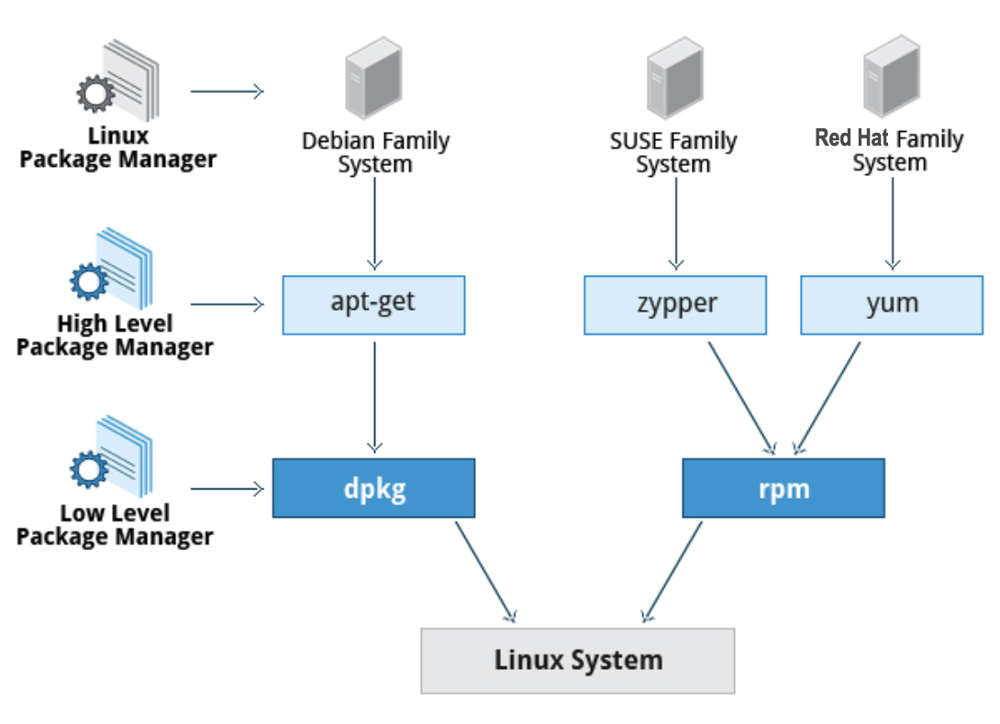

## Finding files 

* Specify the type 
`find / -type f -name toto.txt`
`find / -type d -name directory`

 * Based on time 
`$ find / -ctime 3`
* File accessed
`$ find / -atime 3`
* File modified
`$ find / -mtime 3`

`3` means `n 3` and represent more than 3 days. To represent other times, use :
 * `[+/-][cam]min` 

* Based on size 
`find / -size 0`
` find / -size +10M -exec command {} ';'` 

## Package management 

| Operation | RPM | deb | 
| --- | --- | --- |
| Install package | rpm -i foo.rpm | dpkg --install foo.deb |
| Install package, dependencies | yum install foo | apt-get install foo |
| Remove package | rpm -e foo.rpm | dpkg --remove foo.deb |
| Remove package, dependencies | yum remove foo | apt-get autoremove foo |
| Update package | rpm -U foo.rpm | dpkg --install foo.deb |
| Update package, dependencies | yum update foo | apt-get install foo |
| Update entire system | yum update | apt-get dist-upgrade  |
| Show all installed packages | rpm -qa yum list installed | dpkg --list |
| Get information on package | rpm -qil foo | dpkg --listfiles foo |
| Show packages named foo | yum list "foo" | apt-cache search foo |
| Show all available packages | yum list | apt-cache dumpavail foo |
| What package is file part of? | rpm -qf file | dpkg --search file |
