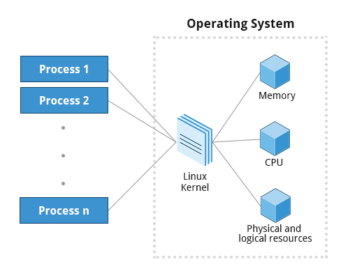
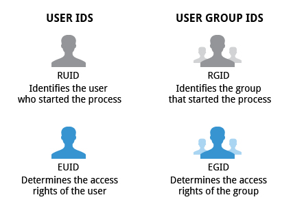

 

# Processes

| Type | Description | Examples |
| --- | --- | --- |
| Batch Processes | Automatic processes which are scheduled from and then disconnected from the terminal. These tasks are queued and work on a FIFO (first-in, first-out) basis. | updatedb |
| Daemons | Server processes that run continuously. Many are launched during system startup and then wait for a user or system request indicating that their service is required. | httpd, xinetd, sshd |
| Interactive Processes | Need to be started by a user, either at a command line or through a graphical interface such as an icon or a menu selection. | bash, firefox, top |
| Kernel Threads | Kernel tasks that users neither start nor terminate and have little control over. These may perform actions like moving a thread from one CPU to another, or making sure input/output operations to disk are completed. | kthreadd, migration, ksoftirqd |
| Process Type | Description | Example |
| Threads | Lightweight processes. These are tasks that run under the umbrella of a main process, sharing memory and other resources, but are scheduled and run by the system on an individual basis. An individual thread can end without terminating the whole process and a process can create new threads at any time. Many non-trivial programs are multi-threaded. | firefox, gnome-terminal-server |

| ID Type | Description |
| --- | --- |
| Process ID (PID) | Unique Process ID number |
| Parent Process ID (PPID) | Process (Parent) that started this process. If the parent dies, the PPID will refer to an adoptive parent; on recent kernels, this is kthreadd which has PPID=2. |
| Thread ID (TID) | Thread ID number. This is the same as the PID for  single-threaded processes. For a multi-threaded process, each thread shares the same PID, but has a unique TID. |

`RUID` = Real user ID  
`EUID` = Efective UID  
`RGID` = Real Group ID  
`EGID` = Effective Group ID  

*the nicer the process, the lower the priority, goes back to the earliest days of UNIX.*

## Background and Foreground Processes

You can put a job in the background by suffixing `&` to the command.  
use the `bg` and `fg` commands to run a process in the background and foreground, respectively.  
<k>CTRL-Z to suspend a foreground job or CTRL-C to terminate a foreground job

The jobs utility displays all jobs running in background. The display shows the job ID, state, and command name, as shown here.

jobs -l provides the same information as jobs, including the PID of the background jobs.

## TOP 

Collumn description 

 * Process Identification Number (PID)
 * Process owner (USER)
 * Priority (PR) and nice values (NI)
 * Virtual (VIRT), physical (RES), and shared memory (SHR)
 * Status (S)
 * Percentage of CPU (%CPU) and memory (%MEM) us
 * Execution time (TIME+)
 * Command (COMMAND).

| Command | Output |
| --- | --- |
| t | Display or hide summary information (rows 2 and 3) |
| m | Display or hide memory information (rows 4 and 5) |
| A | Sort the process list by top resource consumers |
| r | Renice (change the priority of) a specific processes |
| k | Kill a specific process |
| f | Enter the top configuration screen |
| o | Interactively select a new sort order in the process list |

## Scheduling Future Processes Using at

